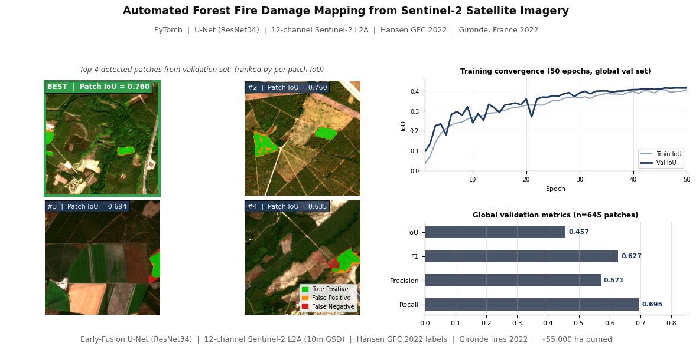
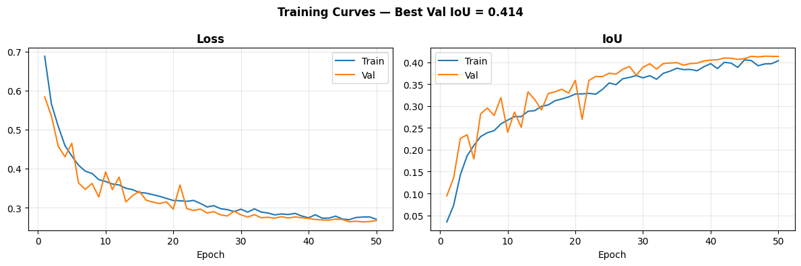

# Forest Disturbance Detection from Bitemporal Sentinel-2

Binary forest loss detection from paired pre/post-fire satellite images using early-fusion U-Net. Trained and evaluated on the 2022 Gironde wildfires, southwestern France (~55,000 ha).

---

## Summary

Trained a 12-channel early-fusion U-Net (ResNet34 encoder) to map forest loss from Sentinel-2 L2A image pairs at 10m resolution. T1 (pre-fire, July 2022) and T2 (post-fire, September 2022) are concatenated channel-wise as a 12-band input, allowing the encoder to learn cross-temporal spectral change patterns end-to-end.

Ground truth labels come from Hansen GFC 2022 (forest loss year 2022, canopy cover >= 10%).

| Metric | Value |
|--------|-------|
| Val IoU | **0.457** |
| F1 | 0.627 |
| Precision | 0.571 |
| Recall | 0.695 |

---

## Motivation

The Gironde fires of July-August 2022 burned ~55,000 ha of the Landes massif, the largest planted forest in Western Europe and the largest wildfires in France since 1949. Damage assessment based on manual image interpretation takes weeks. Sentinel-2 revisit time (5 days) and 10m resolution make automated change detection viable for near-real-time burned area mapping.

Burned area mapping is framed here as a binary segmentation problem: given two temporally aligned multispectral images, classify every pixel as forest loss or no change.

---

## Data

| Dataset | Source | Resolution | Role |
|---------|--------|------------|------|
| Sentinel-2 L2A T1 (2022-07-09) | Microsoft Planetary Computer STAC | 10m | Pre-fire input |
| Sentinel-2 L2A T2 (2022-09-22) | Microsoft Planetary Computer STAC | 10m | Post-fire input |
| Hansen GFC 2022 | Global Forest Watch | 30m resampled to 10m | Binary forest loss labels |

Tile: MGRS T30TYQ (EPSG:32630). Both scenes have <1% cloud cover after SCL masking.  
Hansen labels filtered to `lossyear == 22` and `treecover2000 >= 10%`.

---

## Methodology

### Architecture

Early-fusion U-Net: T1 and T2 (each 6 bands: B02, B03, B04, B8A, B11, B12) are concatenated before the first encoder layer. The ResNet34 backbone processes all 12 channels jointly, learning cross-temporal spectral differences from the start rather than fusing branch outputs at a later stage.

### Data pipeline

1. Download T1/T2 from Planetary Computer STAC, filtered by fire center geometry to avoid tile boundary selection errors
2. Build 6-band stacks at 10m, resample 20m bands (B8A, B11, B12) via bilinear interpolation, apply SCL cloud mask
3. Reproject Hansen GFC 2022 labels to EPSG:32630, align to Sentinel-2 10m grid
4. Extract 256x256 patches at stride 128, enforce 1:3 positive:negative ratio — 3,224 patches (806 positive, 2,418 negative)
5. 80/20 train/val random split (seed 42)

### Training

| Parameter | Value |
|-----------|-------|
| Loss | 0.5 * BCE (pos_weight=3.0) + 0.5 * Dice |
| Optimizer | Adam, lr=1e-4 |
| Scheduler | CosineAnnealingLR (T_max=50) |
| Epochs | 50 |
| Batch size | 8 |
| Augmentation | RandomCrop(224), HorizontalFlip, VerticalFlip, RandomRotate90 |
| Hardware | Google Colab A100, ~6 min total |

---

## Results

The model detects burned patches across varied landscape contexts: pure forest, forest/agriculture mosaics, and forest edges. Recall (0.695) exceeds precision (0.571), consistent with the asymmetric BCE weighting. In operational damage monitoring, missing a burned area carries higher cost than a false alarm.

Training and validation IoU converge in parallel across 50 epochs with no sign of overfitting despite the limited patch count (3,224 patches).

---

## Stack

Python 3.10 | PyTorch | segmentation-models-pytorch | rasterio | GDAL | geopandas | albumentations | pystac-client

---

## License

MIT
